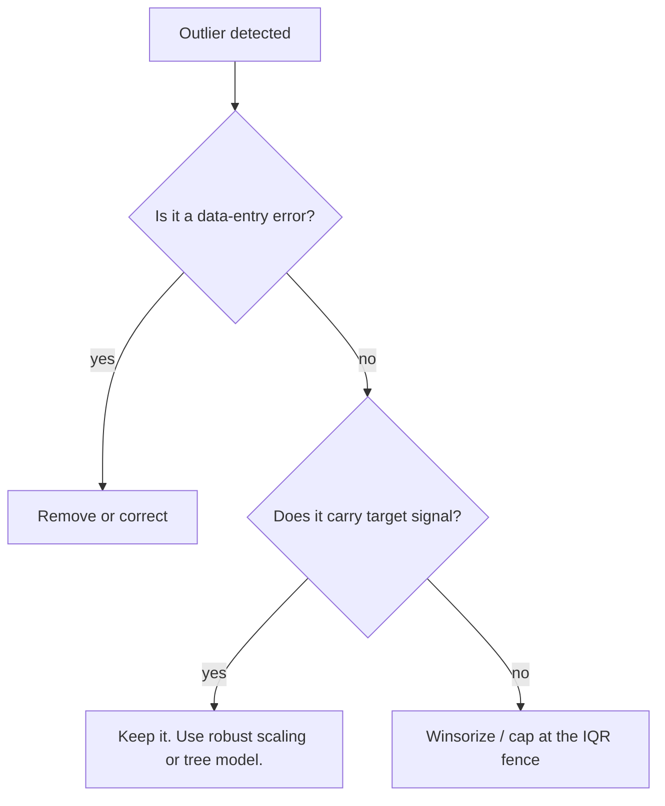
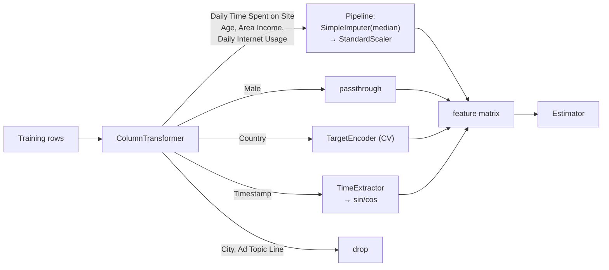
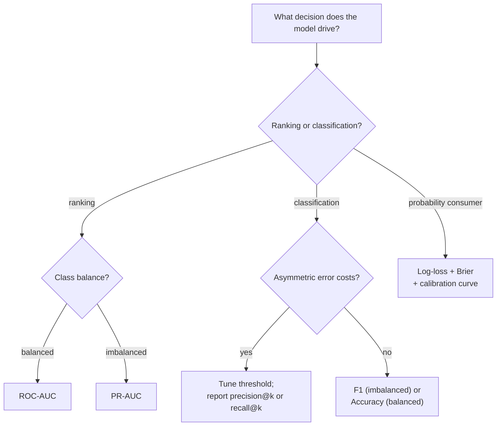
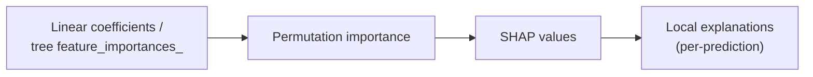
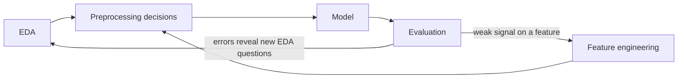

# End-to-End Tabular ML Study Guide

**Project:** Advertisement — Click on Ad (P4AI-DS / CO3135)
**Dataset:** `data/advertising.csv` — 1,000 rows, 9 features, binary target `Clicked on Ad`
**Goal of this document:** Go beyond *what code to write* and teach *why each step exists*, *what insight it produces*, and *what decision it forces downstream*. Read this alongside:

- [`eda_tabular.ipynb`](eda_tabular.ipynb) — the EDA artifact
- [`modeling_tabular.ipynb`](modeling_tabular.ipynb) — preprocessing + model training + tuning
- [`evaluation_tabular.ipynb`](evaluation_tabular.ipynb) — held-out evaluation + explainability

---

## 0. The pipeline in one picture


Every block exists to *answer one question*:

| Block | Question it answers |
|---|---|
| EDA | Is this data trustworthy and what shape is the signal? |
| Preprocessing | How do I feed this data to a model without leaking or distorting it? |
| Train/test split | How will I honestly estimate generalization? |
| CV comparison | Which model family fits this signal best? |
| Tuning | Can I push the winner further without overfitting? |
| Held-out evaluation | What performance should I actually report? |
| Explainability | Do I trust the model, and *why* does it predict what it predicts? |
| Report card | What is the single-page takeaway for a decision-maker? |

---

## 1. Mental model for EDA

EDA is not "make pretty plots." It is a structured interrogation that moves along two axes:

```
Data quality  →  Univariate signal  →  Bivariate signal  →  Target signal  →  Modeling implication
```

Each step outputs (a) a numeric/visual finding and (b) a concrete *decision* about preprocessing or modeling. If a step does not change your downstream behavior, you did not need it.

### The five-question frame (use this for every section)

1. **Goal:** what am I trying to learn?
2. **How:** which metric or plot reveals it?
3. **What to look at:** which numerical thresholds or visual cues matter?
4. **Interpret:** what does the observation *mean*?
5. **Decision:** what will I change in the pipeline because of this?

---

## 2. Phase A — EDA step by step

### A1. Data quality audit

**Goal.** Confirm the dataset is model-ready — no silent corruption.

**How.** `df.info()`, `df.isna().sum()`, `df.duplicated().sum()`, `df[target].value_counts(normalize=True)`.

**What to look at.**
- Missing-value pattern: are NaNs **MCAR** (random), **MAR** (depends on observed features) or **MNAR** (depends on the missing value itself)?
- Duplicates: row-level duplicates are nearly always bugs; *business-key* duplicates (same customer, two rows) are a modeling decision.
- Class balance: if minority class < 20 %, accuracy becomes misleading.

**Interpret for our dataset.** 0 missing, 0 duplicate rows, 50/50 class balance.

**Decisions driven.**
- No imputer strictly required; we still wire one into the pipeline so the code is robust to new data.
- Accuracy is a valid *headline* metric here (balanced) — but we still track PR-AUC, ROC-AUC, log-loss because (i) deployed data may drift toward imbalance and (ii) accuracy hides calibration and ranking quality.
- No class weighting or SMOTE needed now.

**Pitfalls.** Sentinel values pretending to be real numbers (e.g., `Age = -1`, `Income = 999999`). Always skim `.describe()` and the min/max of every numeric column.

---

### A2. Feature role audit

**Goal.** Split the 9 columns into *predictors*, *identifiers/leakage*, and *needs engineering*.

**How.** Cardinality ratio: `df[col].nunique() / len(df)`. Values near 1.0 flag an identifier.

**What you see in this dataset.**

| Column | n_unique | Role | Verdict |
|---|---|---|---|
| `Daily Time Spent on Site` | 900 | Numeric continuous | Predictor |
| `Age` | 43 | Numeric integer | Predictor |
| `Area Income` | 1000 | Numeric continuous | Predictor |
| `Daily Internet Usage` | 966 | Numeric continuous | Predictor |
| `Male` | 2 | Binary | Predictor (keep, even if weak) |
| `Ad Topic Line` | 1000 | String, 100 % unique | **Identifier — drop** (or NLP feature) |
| `City` | 969 | String, 96.9 % unique | **High-cardinality — drop** or hash |
| `Country` | 237 | String, mid-cardinality | Keep, needs smart encoding |
| `Timestamp` | 1000 | Datetime, unique | Engineer into hour/dow/month |

**Interpret.** `Ad Topic Line` is effectively a primary key: one-hot would produce 1,000 columns each appearing once — a memorization vector that would overfit perfectly in-fold and generalize zero. `City` is the same story with 96.9 % uniqueness. `Country` at 237 levels can be encoded but one-hot would still add 236 sparse columns for a dataset of only 1,000 rows — the classic **curse of dimensionality / sample-efficiency trap**.

**Decisions driven.**
- Drop: `Ad Topic Line`, `City`.
- Engineer: `Timestamp` → `hour`, `dayofweek`, `month`, + sin/cos of `hour`.
- Target-encode `Country` with **CV-folded target encoding** to avoid leakage (see Section 7).

**Pitfalls.** Quietly one-hot encoding high-cardinality strings then wondering why the model "overfits". The real problem is the *representation*, not the model.

---

### A3. Univariate numerical analysis

**Goal.** Understand each numeric column *in isolation*: where is the center, how wide is the spread, is the tail heavy, are there outliers?

**How.**
- Central tendency: `mean`, `median`.
- Dispersion: `std`, IQR = Q3 − Q1.
- Shape: skewness (≈ 0 symmetric, > 1 strongly right-skewed, < −1 strongly left-skewed), kurtosis (> 3 heavy-tailed, < 0 flat/bimodal).
- Plots: histogram + KDE, box plot.

**What we see.**

| Feature | mean | median | std | skew | kurt | Reading |
|---|---|---|---|---|---|---|
| Daily Time Spent on Site | 65.0 | 68.2 | 15.9 | −0.37 | −1.10 | Slightly left-skewed, flat/bimodal shape |
| Age | 36.0 | 35.0 | 8.8 | 0.48 | −0.40 | Mildly right-skewed, near-normal |
| Area Income | 55,000 | 57,012 | 13,415 | −0.65 | −0.10 | Left-skewed with an income floor |
| Daily Internet Usage | 180.0 | 183.1 | 43.9 | −0.03 | −1.27 | Clearly bimodal (flat top, negative kurtosis) |
| Male | 0.48 | 0 | 0.50 | 0.08 | −2.00 | Binary (flat kurtosis is expected) |

**Interpret.** Negative kurtosis on `Daily Internet Usage` and `Daily Time Spent on Site` is a **huge hint**: these distributions have two humps, i.e. two populations — very likely the clickers vs non-clickers. That is exactly the signal we want the classifier to latch onto.

**Decisions driven.**
- **Scaling?** Yes for distance-based / linear models (KNN, SVM, Logistic Regression) because `Area Income` is ~10,000× the scale of `Male`. No for tree models — they are scale-invariant.
- **Transform?** No log/Box-Cox needed; no extreme skew.
- **Outlier strategy?** IQR rule shows few outliers (see A3b). Trees handle them natively; for linear models we use `RobustScaler` as a drop-in or cap with Winsorization.

**Pitfalls.**
- Reporting only the mean on skewed data hides the real center.
- Dropping outliers "to clean the data" when they are actually the signal (e.g., a clicker with unusually low internet usage is a signal, not noise).

#### A3b. Outlier detection (IQR rule)

A point is flagged if it lies below `Q1 − 1.5·IQR` or above `Q3 + 1.5·IQR`. The 1.5 constant assumes approximately normal data; for heavy-tailed data use 3.0 or robust z-scores.

**Decision tree for outliers.**



---

### A4. Univariate categorical analysis

**Goal.** For each categorical feature, understand level distribution and cardinality.

**How.** `value_counts()`, bar chart of top-K with support counts, cardinality ratio.

**Thresholds to memorize.**
- Cardinality ratio > 0.95 → identifier, drop.
- Cardinality ratio 0.10–0.95 → high-cardinality; target-encode, hash, or frequency-encode.
- Unique levels ≤ 10 → one-hot encode safely.
- Any level with support < 1 % (or < 30 rows for n=1,000) → **rare level**, merge into `__other__`.

**Decisions driven.**
- `Country`: 237 levels, most with 1–5 rows. One-hot is wasteful. We apply **target encoding with out-of-fold smoothing** to inject `Country` into the numeric space without memorizing the training set.
- `City`, `Ad Topic Line`: drop.

**Pitfalls — "support-aware reading".**
If `Country = Zimbabwe` has 2 rows and both clicked, the raw click rate is 100 %. Reporting "Zimbabwe has 100 % click rate" is statistically nonsensical. Every categorical rate needs its support count reported next to it, and downstream target encoding must be *smoothed* toward the global mean inversely proportional to support.

---

### A5. Bivariate analysis / correlation

**Goal.** Find feature-feature relationships to diagnose **multicollinearity** and redundancy.

**How.**
- Pearson r — linear, numeric-numeric only.
- Spearman ρ — rank-based, captures any monotonic relation, robust to outliers.
- Cramér's V — association between two categoricals.
- Correlation ratio η — numeric vs categorical.

**What we see (Pearson on numerics).**

| Pair | r |
|---|---|
| `Daily Time Spent on Site` ↔ `Daily Internet Usage` | 0.519 |
| `Age` ↔ `Daily Internet Usage` | −0.367 |
| `Area Income` ↔ `Daily Internet Usage` | 0.338 |
| `Daily Time Spent on Site` ↔ `Age` | −0.332 |
| `Daily Time Spent on Site` ↔ `Area Income` | 0.311 |

**Interpretation rules of thumb.**

| \|r\| | Reading |
|---|---|
| < 0.1 | Effectively independent |
| 0.1 – 0.3 | Weak |
| 0.3 – 0.5 | Moderate — note it |
| 0.5 – 0.7 | Strong — watch for multicollinearity |
| > 0.7 | Redundant — one feature may be dropped or combined |

**Decisions driven.** The 0.52 correlation between `Daily Time Spent on Site` and `Daily Internet Usage` is moderate, *not* high enough to drop either. Logistic Regression coefficients will become *less interpretable individually* (multicollinearity inflates variance of coefficient estimates) but predictive power is unaffected. We keep both and rely on regularization (L2) to stabilize coefficients.

**Why the heatmap alone is insufficient.**
- Pearson = 0 does not mean independent (it only detects *linear*).
- No causation: `Age` correlating with `Daily Internet Usage` tells you nothing about direction.
- No interaction: two features with r ≈ 0 can still jointly predict the target via an interaction (e.g., only young *and* high-income users click).

---

### A6. Target-signal ranking

**Goal.** For each feature, quantify how strongly it discriminates the two classes.

**How.**
- **Numeric → target**: Pearson r, or mean difference between class 0 and class 1, or **mutual information** (captures non-linear signal).
- **Categorical → target**: click rate per level with support count.

**What we see.**

| Feature | Corr with target | NoClick mean | Click mean | Relative diff |
|---|---|---|---|---|
| Daily Internet Usage | −0.787 | 214.5 | 145.5 | **32 %** |
| Daily Time Spent on Site | −0.748 | 76.9 | 53.2 | **31 %** |
| Age | +0.493 | 31.7 | 40.3 | 27 % |
| Area Income | −0.476 | 61,386 | 48,614 | 21 % |
| Male | −0.038 | 0.50 | 0.46 | 8 % |

**Interpret.** Behavioral features (`Daily Internet Usage`, `Daily Time Spent on Site`) dominate. Demographics (`Age`, `Area Income`) are secondary. `Male` is essentially noise.

**Direction of effect — read it out loud.**
- *Heavier* internet users click **less**. Intuition: power users are ad-blind.
- *Younger* users click **less**. Intuition: they are more skeptical/ad-averse.
- *Higher-income* users click **less**. Intuition: less impulse-driven.

**Decisions driven.**
- Keep all four behavioral+demographic features.
- Consider dropping `Male`, or keep it — a tree will split on it for free and it adds minimal variance.
- Strong univariate signal + roughly linear direction → **Logistic Regression should be a genuinely competitive baseline**, not a strawman.

**Pitfalls.**
- Mutual information is scale-free and catches non-linear signal that Pearson misses. Always compute both.
- A feature with zero univariate signal may still be powerful *in interaction* with another. Do not drop it based only on univariate correlation if you have a tree model downstream.

---

### A7. Temporal analysis

**Goal.** Extract time-of-day / day-of-week / month effects from `Timestamp`.

**How.** Parse datetime, extract `hour`, `dayofweek`, `month`. Plot click rate per bin **with support count**. Sin/cos encode cyclical features so the model knows hour 23 is adjacent to hour 0.

**Sin/cos formula** — for a feature `x` with period `P`:
- `x_sin = sin(2π · x / P)`
- `x_cos = cos(2π · x / P)`

Use P = 24 for hour, P = 7 for day-of-week, P = 12 for month.

**Why not just one-hot the hour?** One-hot treats hour 23 and hour 0 as maximally distant. Sin/cos preserves the cycle. Trees can get away with ordinal hour; linear models need sin/cos.

**Decisions driven for this dataset.** The Timestamp covers roughly 4 months of 2016 data — too short to learn robust seasonality. Hour/day effects exist but are noisy at n=1,000. We add them to the feature set, but the expected marginal gain is small.

---

### A8. Modeling-readiness checklist (the bridge into Phase B)

| Finding | Pipeline consequence |
|---|---|
| 0 missing, 0 duplicates, 50/50 balanced | No imputer/resampler needed logically; wire `SimpleImputer(median)` anyway for robustness |
| Very different scales (Income ~10^4 vs Male ∈ {0,1}) | StandardScaler for linear/SVM/KNN; passthrough for trees |
| Mild negative kurtosis in 2 behavioral features | Suggests a natural class boundary → Logistic Regression will work well |
| Moderate Daily Time ↔ Internet Usage correlation (0.52) | Use L2 regularization in LR; ensemble models are unaffected |
| `Country` 237 levels | Target encoding with CV-out-of-fold |
| `City` and `Ad Topic Line` near-unique | Drop |
| `Timestamp` unique | Feature-engineer hour/dow/month + sin/cos |
| Strong univariate signal | Expect high AUC (> 0.95 plausible). Do not confuse with overfitting — verify via held-out + CV |

---

## 3. Phase B — Preprocessing (in `modeling_tabular.ipynb`)

### B1. Train/test split

**What.** `train_test_split(X, y, test_size=0.2, stratify=y, random_state=42)`.

**Why stratify when balanced?** Stratification reduces *variance* of fold estimates even at 50/50. Without it, random draws can give 48/52 in a fold, and if you run 5-fold CV this noise compounds. Stratify always.

**Why a fixed `random_state`?** Reproducibility. Someone else re-running the notebook must see the same numbers.

**Why 80/20?** With n=1,000 we want 200 test points — enough that the 95 % CI on accuracy is ±6 pp (Wilson interval). At 90/10 we would have 100 test points and ±9 pp CI, too imprecise.

### B2. Where should each transformation live?

Rule: **any statistic learned from data belongs inside the Pipeline, not outside.**

| Operation | Inside pipeline? |
|---|---|
| Impute with median | Yes — learn median on train fold only |
| Scale | Yes |
| Target encode | Yes — with out-of-fold CV |
| Extract hour from timestamp | No — deterministic, no parameters |
| Drop identifier columns | No — deterministic |
| Log-transform | Yes if learned; no if fixed |

Violating this rule is the most common source of **data leakage** — see Section 8.

### B3. ColumnTransformer layout



For tree models we build a *second* ColumnTransformer where the numeric branch is `SimpleImputer` only (no scaler), because scaling is wasted compute on trees.

### B4. Class-imbalance toolkit (not used here, but you must know it)

Three levers, from cheapest to most invasive:

1. **Threshold tuning** — train on imbalanced data, then choose a classification threshold ≠ 0.5 on the validation set to hit your precision/recall target. Preserves probability calibration.
2. **Class weights** — `class_weight='balanced'` in LR/SVM/tree learners. Re-weights the loss. Cheap and effective.
3. **Resampling** — SMOTE (synthetic minority oversampling), random under-sampling. Distorts the joint distribution; only use if 1 & 2 are not enough.

Prefer (1) when downstream consumes probabilities; (2) when using default-threshold predictions; (3) only as a last resort.

---

## 4. Phase C — Model building

### C1. Model family matrix

| Model | Bias-variance | Scaling needed | Handles mixed types | Interpretability | Expected on this data |
|---|---|---|---|---|---|
| Logistic Regression | High bias, low variance | Yes | No (needs encoding) | Coefficients → log-odds | Strong baseline (linear separation is clear) |
| Random Forest | Low bias, medium variance | No | Yes | Feature importances | Good; may overfit n=1,000 if max_depth uncapped |
| Gradient Boosting (XGBoost / HistGradientBoosting) | Low bias, medium variance with regularization | No | Yes | SHAP | Usually state-of-the-art on tabular; expect best ROC-AUC |

### C2. Key hyperparameters (the ones that actually matter)

- **Logistic Regression**: `C` (inverse L2 strength). Small C → strong regularization. Search on a log scale.
- **Random Forest**: `n_estimators` (more is better, saturates), `max_depth` (the main overfitting knob), `min_samples_leaf` (smooths), `max_features` (decorrelates trees).
- **Gradient Boosting**: `learning_rate` (smaller → need more trees), `n_estimators` (use early stopping!), `max_depth` (usually 3–8), `subsample`, `min_child_weight` / `min_samples_leaf`, `reg_lambda`.

Rule of thumb: tune `learning_rate + n_estimators` together (with early stopping on a held-out fold) and `max_depth` separately. The other knobs give diminishing returns.

### C3. Cross-validation protocol

```python
cv = StratifiedKFold(n_splits=5, shuffle=True, random_state=42)
cross_validate(
    pipeline, X_train, y_train, cv=cv,
    scoring=['accuracy', 'roc_auc', 'average_precision', 'f1', 'neg_log_loss'],
    return_train_score=True, n_jobs=-1
)
```

Report **mean ± std** of each metric. If std is large (> 2 pp), your dataset is small and fold variance is high — trust the mean less.

**Why 5-fold and not 10-fold?** At n=1,000, 10-fold would give 100-sample validation sets → high variance of per-fold metrics. 5-fold is a better bias-variance trade-off for small data.

**Why report `train_score` too?** The train-test gap *is* the overfitting diagnostic. If train AUC = 1.0 and CV AUC = 0.75, you have a variance problem → more regularization, less depth, more data.

### C4. Hyperparameter tuning

Use `RandomizedSearchCV` with `n_iter=40`, same 5-fold stratified CV, scoring on `roc_auc`.

**Why randomized over grid?** Grid wastes budget on axis-aligned combinations. Randomized explores the space more uniformly and scales better as hyperparameter count grows.

**Why tune *after* picking the winning family?** Cheap: one tuning run instead of three. Defensible because all three models in C1 have similar *capacity floor*, so the ranking at default settings usually survives tuning. For a rigorous paper you would tune each model, then compare.

### C5. Reproducibility checklist

- `random_state=42` everywhere (split, CV, model, sampler).
- `np.random.seed(42)` at notebook top.
- Pin versions: `scikit-learn>=1.3`, `xgboost>=2.0`, `shap>=0.44`.
- Serialize the fitted pipeline with `joblib.dump(model, 'artifacts/best_model.joblib')`.

---

## 5. Phase D — Evaluation

Evaluation has two lenses. Do not skip either.

1. **Statistical performance** — is the model accurate in aggregate?
2. **Business decision quality** — is it calibrated, and does it make the right trade-off on *this* problem?

### D1. Metric menu

| Metric | What it measures | When it is the right headline |
|---|---|---|
| Accuracy | Fraction correct at threshold 0.5 | Balanced classes, equal error cost |
| Precision | Of predicted positives, how many are correct | FP is expensive (wasted ad spend) |
| Recall / sensitivity | Of true positives, how many caught | FN is expensive (missed conversion) |
| F1 | Harmonic mean of P and R | You care about both, single number |
| ROC-AUC | Ranking quality across all thresholds | Threshold-free comparison |
| PR-AUC (average precision) | Ranking quality under class imbalance | Minority class important |
| Log-loss | Penalizes confident wrong predictions | You will consume probabilities |
| Brier score | MSE of probabilities vs outcomes | Calibration quality |

**Metric selection decision tree.**



### D2. Confusion matrix framing

For click prediction:
- **True Positive (TP)** — predicted click, did click. Good: ad spent wisely.
- **False Positive (FP)** — predicted click, did not. Cost: wasted impression.
- **False Negative (FN)** — predicted no-click, did click. Cost: missed conversion.
- **True Negative (TN)** — predicted no-click, did not. Fine.

Write the cost matrix before you tune the threshold. If revenue per click = \$10 and cost per impression = \$0.10, then the breakeven threshold is where `E[revenue | p] = E[cost]`, i.e. `p* = 0.10 / 10 = 0.01` — much lower than 0.5. This is why *threshold tuning* matters.

### D3. ROC and PR curves

- **ROC curve**: TPR vs FPR across thresholds. Area = probability a random positive is scored higher than a random negative.
- **PR curve**: Precision vs Recall. Always look at this when classes are imbalanced — ROC is optimistic on imbalanced data.

Overlay all candidate models on one ROC and one PR plot for an instant visual comparison.

### D4. Calibration

A model is **calibrated** if, among instances predicted with probability p, the observed positive rate is p.

- Plot: bin predictions into deciles, plot mean predicted vs observed rate. Perfect calibration is the diagonal.
- Metric: **Brier score** = mean squared error of `(p - y)`.
- Fix: `CalibratedClassifierCV(base, method='isotonic', cv=5)` (non-parametric) or `method='sigmoid'` (Platt scaling, parametric).

**Why this matters.** Two models with identical ROC-AUC can have very different calibration. Tree ensembles and SVMs are typically **under-confident** (pushed toward 0.5); they benefit from Platt/isotonic post-processing. Logistic Regression is usually already calibrated.

### D5. Threshold tuning

Sweep t ∈ [0.01, 0.99] in steps of 0.01. For each t, compute precision, recall, F1, and business expected value. Plot all four curves.

Pick `t*` by one of:
- Max F1 — default if costs unknown.
- Max expected value — if cost matrix known.
- Recall target — e.g., "catch 90 % of clickers" → smallest t with recall ≥ 0.9.
- Precision target — "at least 80 % of impressions convert" → smallest t with precision ≥ 0.8.

Report the chosen threshold *and* the rationale.

### D6. Learning curve & validation curve

- **Learning curve**: train + validation score as a function of training set size. Diagnoses *data hunger*.
  - High bias: both curves low and close → need a stronger model.
  - High variance: train high, val low, big gap → need more regularization, more data, or simpler model.
- **Validation curve**: val score as a function of one hyperparameter. Finds the sweet spot visually.

### D7. Permutation importance

For each feature, shuffle its values in the test set and measure the metric drop. Model-agnostic, unbiased by scale, and more trustworthy than `feature_importances_` (which can be biased toward high-cardinality features in tree models).

### D8. SHAP explanations

SHAP (SHapley Additive exPlanations) decomposes each prediction into per-feature contributions that sum (up to a base value) to the predicted log-odds. It satisfies the additive, consistency, and local accuracy properties from cooperative game theory.

What to produce:
1. **Global summary plot** (beeswarm): feature ranking + direction of effect across the dataset.
2. **Dependence plot** for the top 2 features: SHAP value vs feature value, colored by an interacting feature. Reveals non-linearities and interactions.
3. **Waterfall / force plot** for 2 individual predictions: one confident TP, one confident FP. Pedagogical for communicating *why* on a single case.

`TreeExplainer` is exact and fast for tree models. For non-tree models use `KernelExplainer` (slow) or `LinearExplainer` (fast, LR only).

### D9. Error analysis by slice

Pick segmentations: `Age` bin (quartiles), `Area Income` bin, top-5 `Country`, `hour` bucket. For each slice, compute accuracy and AUC. A slice where AUC drops > 5 pp below the global AUC is a **failure mode** — document it.

This is the bridge to fairness analysis. The questions ("does the model under-serve any demographic?") are identical even when the dataset has no protected attributes.

### D10. Final report card (template)

```
Model:              <family + key hyperparameters>
Dataset:            1,000 rows, 80/20 stratified split, seed 42
Headline metric:    ROC-AUC = 0.XX  (95 % CI [a, b] via 1000-bootstrap)
Secondary:          PR-AUC, F1, Accuracy @ tuned threshold
Calibration:        Brier = 0.XX, isotonic-calibrated
Chosen threshold:   0.XX  (maximizes F1 on validation)
Top 5 drivers:      (from SHAP mean |value|)
Known weaknesses:   e.g., AUC drops to 0.XX on <slice>
Next steps:         more data, add interaction terms, deploy A/B test
```

---

## 6. Phase E — Cross-cutting concepts

### E1. Bias, variance, irreducible error

Expected test error decomposes into:

\[ E[(y - \hat{f}(x))^2] = \underbrace{(E[\hat{f}(x)] - f(x))^2}_{\text{bias}^2} + \underbrace{\text{Var}(\hat{f}(x))}_{\text{variance}} + \underbrace{\sigma^2}_{\text{irreducible}} \]

- **Bias** ↓ by bigger/more-flexible model, richer features.
- **Variance** ↓ by regularization, more data, averaging (ensembles).
- **Irreducible** ↓ only by collecting *better* data (new features, less measurement noise).

Every preprocessing and modeling decision is a point on the bias-variance curve. EDA's role is to diagnose which term dominates so you spend effort on the right fix.

### E2. Data leakage — the four flavors

| Flavor | Example | Fix |
|---|---|---|
| **Target leakage** | A feature computed using the target (e.g., "converted_amount" when predicting "converted") | Remove. Audit feature definitions. |
| **Train-test contamination** | Scaling on the full dataset before splitting | Wrap scaler inside `Pipeline`; fit only on train fold. |
| **Group leakage** | Same user appears in train and test | Use `GroupKFold` on the user id. |
| **Temporal leakage** | Future data used to predict the past | Use `TimeSeriesSplit`; never shuffle. |

For our dataset specifically:
- Target-encoding `Country` without cross-validation is **train-test contamination**. Use `sklearn.preprocessing.TargetEncoder` (sklearn ≥ 1.3) which handles this correctly, or fold manually.
- `Timestamp` is unique per row, so no group leakage risk here; but in a real ad-tech dataset you would group by user id.

### E3. Why Pipelines, really

Three reasons, in order of importance:

1. **Prevents leakage.** `pipeline.fit(X_train)` learns every statistic on the train fold only. `cross_validate(pipeline, ...)` re-fits the *whole* pipeline per fold.
2. **Atomic serialization.** `joblib.dump(pipeline)` saves preprocessing and model together. Deployment uses the same object.
3. **Grid-searchable preprocessing.** `GridSearchCV` over `{'preprocessor__num__scaler': [StandardScaler(), RobustScaler()], 'model__C': [...]}` is one line.

### E4. Interpretability stack



Use the leftmost tool that answers your question:
- Global ranking? → coefficients / importances.
- Model-agnostic global ranking? → permutation importance.
- Per-prediction attribution? → SHAP.

### E5. Reproducibility and environment

Every notebook starts with a setup cell:

```python
import numpy as np, random, os
SEED = 42
np.random.seed(SEED); random.seed(SEED); os.environ['PYTHONHASHSEED'] = str(SEED)
```

Pinned dependencies for this project:

```
pandas>=2.0
numpy>=1.24
scikit-learn>=1.3
matplotlib>=3.7
seaborn>=0.13
xgboost>=2.0
shap>=0.44
joblib>=1.3
```

### E6. The closed-loop mental model



This loop is the whole job. Run it at least twice.

---

## 7. How to read the accompanying notebooks

- `eda_tabular.ipynb` has "Why / Insight / Decision" markdown callouts inserted above each section. Read the callout first, then skim the code, then read the numbers in light of the callout.
- `modeling_tabular.ipynb` follows Phases B and C. Every code cell is preceded by a markdown cell explaining *why* it exists and *what to expect*.
- `evaluation_tabular.ipynb` follows Phase D. The last cell prints the final report card.

---

## 8. Quick-reference cheatsheet

| Symptom in EDA | Likely fix |
|---|---|
| Feature skew > 1 | `np.log1p` or `PowerTransformer(yeo-johnson)` |
| \|r\| > 0.85 between features | Drop one or combine (PCA, sum) |
| Cardinality > 0.5 | Drop or target-encode |
| Rare levels < 1 % | Merge into `__other__` |
| Missing > 30 % in a column | Consider dropping the column |
| One class < 5 % | Use class weights, consider SMOTE, report PR-AUC |
| Train AUC ≫ CV AUC | Reduce capacity, add regularization, more data |
| CV AUC low and flat | Add features, try more flexible model |
| High AUC but bad calibration | Wrap in `CalibratedClassifierCV` |
| Model fails on a slice | Add slice indicator feature, collect more data there |
